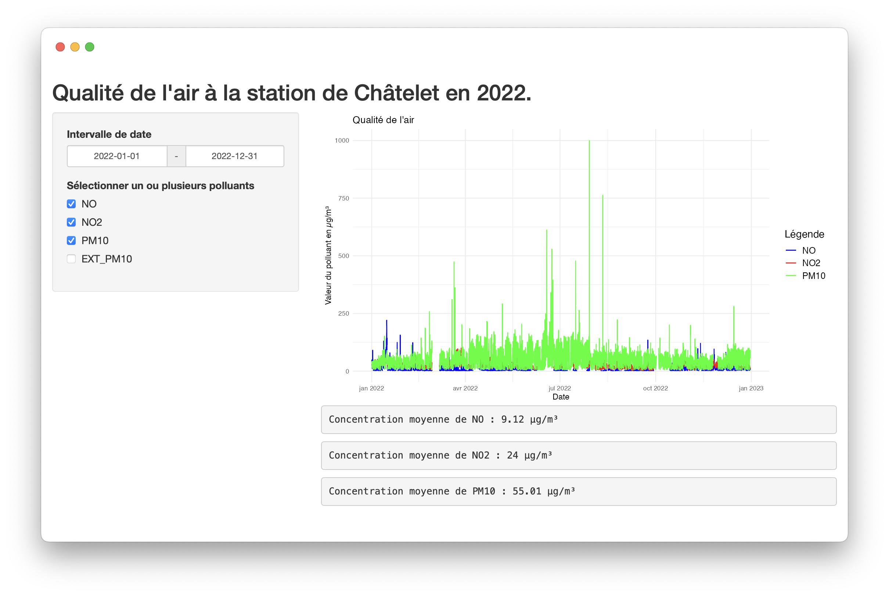
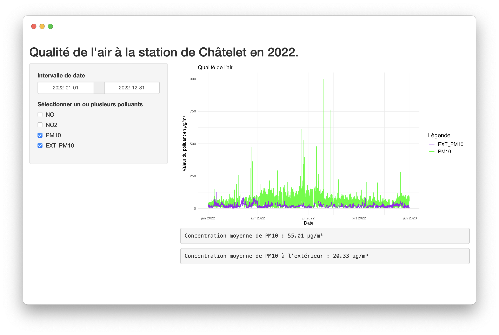

# AirATP — Surveillance de la Qualité de l'Air à la Station Châtelet en 2022.

**AirATP** est une application R Shiny conçue pour surveiller la qualité de l'air à la station de métro Châtelet à Paris, en se concentrant spécifiquement sur la mesure des particules fines (PM10).

## Table des Matières

1. [Introduction](#introduction)
2. [Installation et Configuration](#installation-et-configuration)
3. [Utilisation](#utilisation)
4. [Données](#données)
5. [Captures d'écran](#captures-décran)
6. [Résultats](#résultats)
7. [Limitations et Perspectives](#limitations-et-perspectives)
8. [Contact](#contact)

## Introduction

La qualité de l'air dans les stations de métro est un enjeu majeur de santé publique. AirATP est né de la volonté de surveiller et d'analyser la qualité de l'air à l'intérieur de la station de métro Châtelet, l'une des plus fréquentées de Paris. L'application fournit des visualisations interactives permettant de suivre les niveaux de plusieurs polluants, avec une attention particulière pour les particules fines (PM10).

**Démo en ligne** : [https://nawfelkerarsi.shinyapps.io/airatp/](https://nawfelkerarsi.shinyapps.io/airatp/)

## Installation et Configuration

1. Assurez-vous d'avoir le package Shiny installé sur votre machine. 
Si ce n'est pas le cas, tappez ```install.packages("shiny")``` sur votre IDE R.
2. Clonez ce dépôt GitHub sur votre machine locale.
3. Installez les packages R requis avec la commande `install.packages(c("dplyr", "ggplot2"))`.
4. Lancez l'application R Shiny depuis votre IDE.

## Utilisation

Après avoir lancé l'application, vous pouvez visualiser les concentrations de différents polluants, choisir l'intervalle de dates pour l'analyse et voir la concentration moyenne de chaque polluant sur l'intervalle définie. 

## Données

Les données proviennent de l'[API RATP](https://data.ratp.fr/explore/dataset/qualite-de-lair-mesuree-dans-la-station-chatelet/information/?refine.dateheure=2022), qui fournit chaque heure les mesures de divers polluants, y compris le monoxyde d'azote, le dioxyde d'azote et les particules fines (PM10), ainsi que d'autres informations météorologiques. Cette application se concentre sur les mesures des particules fines (PM10).

Aussi, les données des particules fines à l'extérieur de la station (EXT_PM10) proviennent de l'[API Air Parif](https://data-airparif-asso.opendata.arcgis.com/datasets/2022-pm10/explore).


## Captures d'Écran
*Visualisation du niveau des polluants dans la station sur toute l'année.*

*Comparaison du niveau de particules fines à l'intérieur par rapport à celui à l'extérieur sur toute l'année.*


## Résultats

En 2022, la concentration moyenne annuelle de PM10 à la station Châtelet était de 55.01 µg/m³, soit nettement au-dessus de la limite recommandée par l'Union européenne pour la protection de la santé humaine (40 µg/m³).

La concentration moyenne annuelle de PM10 à l'intérieur de la station Châtelet était presque 3 fois supérieure à celle à l'extérieur de la station (20.33 µg/m³), indiquant une concentration notablement plus élevée de particules fines dans l'environnement intérieur de la station.

## Limitations et Perspectives

Une limitation notable de ce projet est qu'il se concentre uniquement sur la station Châtelet. À l'avenir, nous envisageons d'étendre cette analyse à d'autres stations de métro parisiennes pour obtenir une image plus complète de la qualité de l'air dans le métro parisien.

## Contact

Pour toute question ou commentaire, n'hésitez pas à me contacter :

**Nawfel KERARSI**\
[nawfel.kerarsi@universite-paris-saclay.fr](mailto:nawfel.kerarsi@universite-paris-saclay.fr)